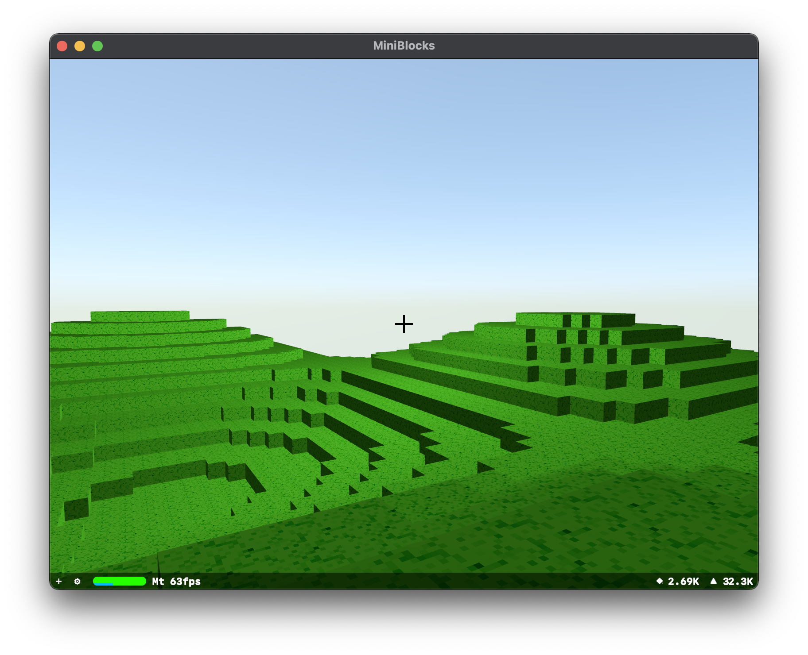

# MiniBlocks

A procedurally generated open-world sandbox game for macOS, inspired by Minecraft.

## Description

MiniBlocks is an open-world sandbox game, inspired by Minecraft. The player is spawned in a three-dimensional voxel world and can interact with it by placing or breaking blocks with the mouse. The world is infinite and new chunks are generated procedurally as the player moves through the world.

World generation is provided through a variety of world generators. The most interesting one - NatureWorldGenerator - incorporates techniques such as perlin noise maps and pseudo-randomness to first generate a height map and then 'decorate' it with structures such as trees.

World loading happens in chunked deltas, i.e. only the new/obsolete chunks are added to/removed from the scene as the player moves.

On the technical side the game uses the AppKit framework for input event handling, the SceneKit framework for rendering and is structured using a combination of the entity-component architecture provided by GameplayKit and classic model-view separation. This choice of architecture makes it easily extendible, avoiding common pitfalls in traditional inheritance-heavy designs, and provides great modularity on top.
