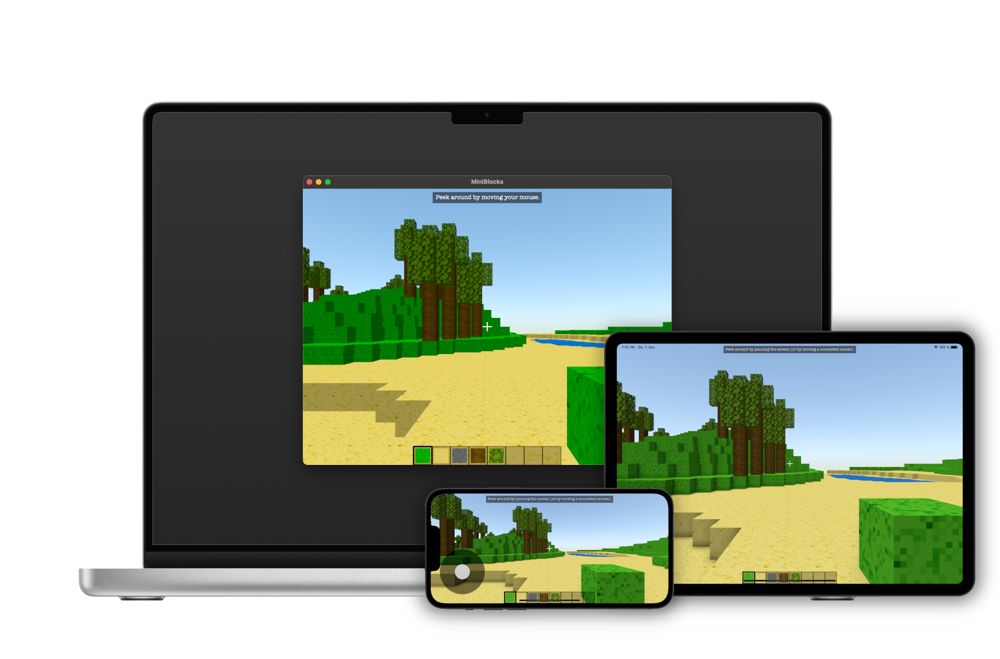

# MiniBlocks

A procedurally generated open-world sandbox game for macOS and iOS, inspired by Minecraft.

## Description

MiniBlocks is an open-world sandbox game, inspired by Minecraft. The player is spawned in a three-dimensional voxel world and can interact with it by placing or breaking blocks with the mouse. The world is infinite and new chunks are generated procedurally as the player moves through the world.

World generation is provided through a variety of world generators. The most interesting one - NatureWorldGenerator - incorporates techniques such as perlin noise maps and pseudo-randomness to first generate a height map and then 'decorate' it with structures such as trees.

World loading happens in chunked deltas, i.e. only the new/obsolete chunks are added to/removed from the scene as the player moves.

On the technical side the game uses the SceneKit framework for rendering and is structured using a combination of the entity-component architecture provided by GameplayKit and classic model-view separation. This choice of architecture makes it extensible, avoiding common pitfalls in traditional inheritance-heavy designs, and provides great modularity on top.

By including a compatibility layer, the game can use either AppKit, GameController or UIKit for input handling, thereby making it possible to play the game both using either mouse/keyboard or touch controls on macOS, iOS and iPadOS.

The game and assets are created entirely from scratch and © fwcd 2022.

## Repository Structure

The code is located [in the playground app project](MiniBlocks.swiftpm) to comply with the Swift Student Challenge's requirements. For convenience, an Xcode project along with actual macOS/iOS targets and unit tests is provided too, however.

## See also

* [MiniCut](https://github.com/fwcd/mini-cut), a tiny video editor built with SpriteKit (my 2021 project)
* [MiniJam](https://github.com/fwcd/mini-jam), a tiny digital audio workstation built with SwiftUI (my 2020 project)
